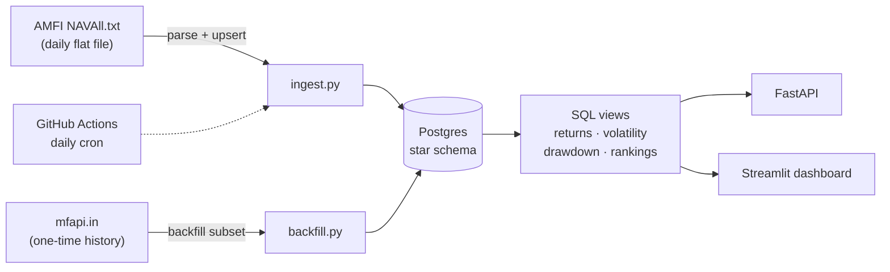
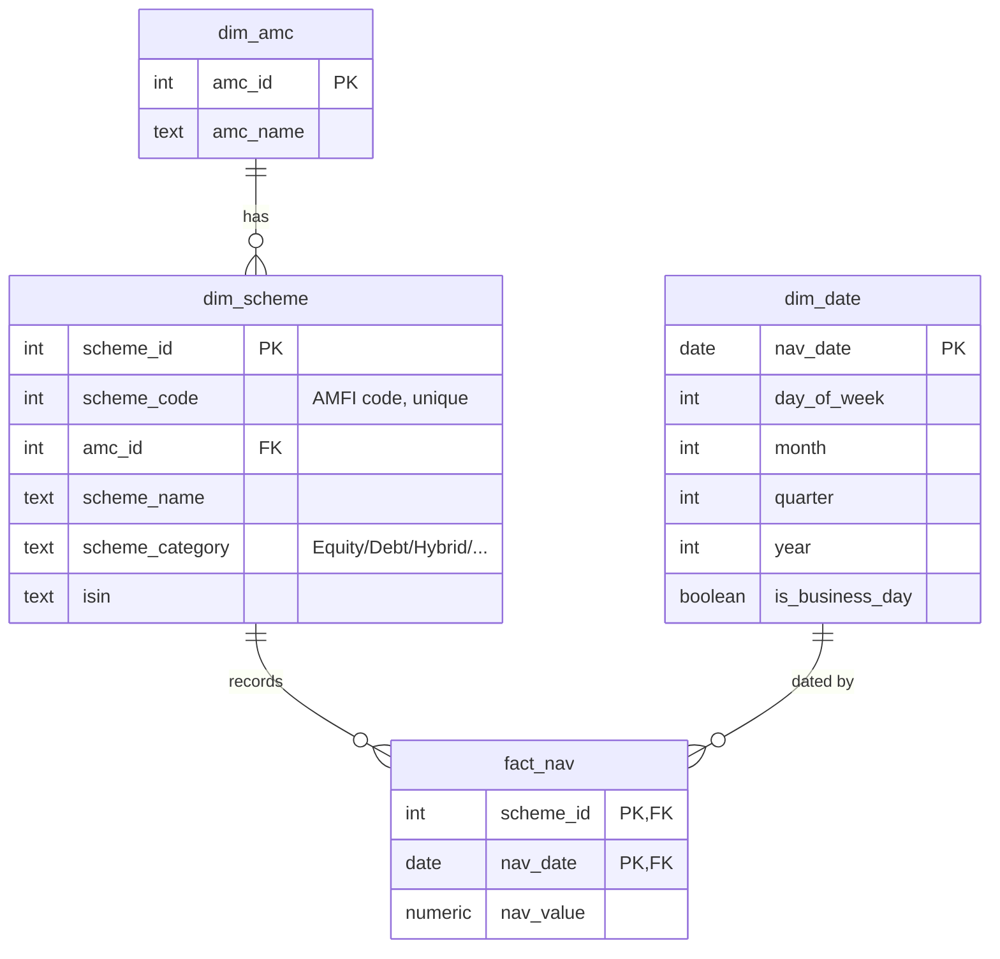

# NAVLens

**A SQL-first analytics pipeline for Indian mutual fund NAVs.** It ingests daily NAV data
from AMFI into a Postgres star schema, computes fund analytics **entirely in SQL** (rolling
returns, annualized volatility, category rankings, maximum drawdown), exposes them through a
FastAPI service, and surfaces them on a Streamlit dashboard. Ingestion is scheduled daily via
GitHub Actions.


> Live demo: _deploy pending_ (Postgres on Neon, API + dashboard on Render).

## The design rule

**Every analytic is computed in SQL, not Pandas.** Rolling returns, volatility, rankings and
drawdowns are all window functions, CTEs and aggregations over the fact table. Python is used
only for ingestion glue and display formatting. The SQL lives in
[`sql/02_views.sql`](sql/02_views.sql) and is the heart of the project.

## Architecture



- **Live source of truth:** AMFI's official `NAVAll.txt` (parsed daily).
- **History:** a one-time backfill of ~2 years for a category-balanced subset of growth-plan
  schemes from `mfapi.in` (a public, AMFI-sourced JSON API), so the window analytics have depth.

## Data model

A classic star schema. The composite primary key on `fact_nav` gives natural deduplication;
`ON CONFLICT DO NOTHING` on insert makes re-running ingestion idempotent.



## The SQL analytics

| View | What it computes | SQL technique |
|------|------------------|---------------|
| `v_daily_returns` | daily simple returns | `LAG()` over `nav_date` |
| `mv_scheme_returns` | 1M/3M/6M/1Y returns per scheme | `LATERAL` as-of lookups (calendar-correct), materialized |
| `v_rolling_volatility` | trailing annualized volatility | windowed `STDDEV()` × √252 |
| `v_drawdown_series` / `v_max_drawdown` | drawdown from running peak | `MAX() OVER` expanding window |
| `v_category_rankings` | rank funds within a category by 1Y return | `RANK() OVER (PARTITION BY ...)` |
| `v_amc_top_equity` | each AMC's best equity fund | multi-stage CTEs (filter → rank → pick) |
| `v_amc_rollup` | per-AMC category averages + grand total | `GROUP BY ROLLUP` |

### Sample query

```sql
-- Top 5 equity funds by trailing 1-year return
SELECT rank_in_category, scheme_name, amc_name, return_1y_pct
FROM v_category_rankings
WHERE scheme_category = 'Equity'
ORDER BY rank_in_category
LIMIT 5;
```

```
 rank | scheme_name                                   | return_1y_pct
------+-----------------------------------------------+---------------
    1 | Bandhan Large & Mid Cap Fund - Direct - Growth|          5.95
    2 | CANARA ROBECO INFRASTRUCTURE FUND - DIRECT ...|          5.70
    3 | Bandhan Focused Fund - Direct Plan - Growth    |          2.56
    ...
```

## API

Run `uvicorn navlens.api:app --reload`, then open `/docs`.

| Endpoint | Description |
|----------|-------------|
| `GET /schemes` | search/filter schemes by name, category, AMC |
| `GET /schemes/{id}/nav` | NAV history |
| `GET /schemes/{id}/returns` | rolling returns |
| `GET /schemes/{id}/drawdown` | drawdown series + max drawdown |
| `GET /schemes/{id}/volatility` | rolling annualized volatility |
| `GET /categories/{category}/rankings` | top/bottom funds in a category |
| `GET /amcs/summary` | AMC-level rollup |

## Run it locally

Requires Docker (for Postgres) and Python 3.13.

```bash
make setup      # create .venv, install deps
make db         # start Postgres 15 in Docker (host port 5433)
make schema     # create tables + views
make ingest     # load today's AMFI NAV file (full universe)
make backfill   # backfill ~2y history for the analytics subset
make api        # FastAPI at http://localhost:8000/docs
make dashboard  # Streamlit at http://localhost:8501
```

## Testing

```bash
make test       # 35 pytest cases
```

Covers the AMFI parser, category mapping, idempotent loading, and SQL view correctness on a
hand-computable seeded dataset. DB tests run against an isolated `navlens_test` database.

## Deployment

1. Create a Postgres on **Neon** (or Supabase); copy its connection string.
2. Run `make schema` and an initial `make ingest` + `make backfill` against it
   (set `DATABASE_URL` to the managed string).
3. Deploy the API and dashboard on **Render** using [`render.yaml`](render.yaml); set
   `DATABASE_URL` on both services.
4. Add `DATABASE_URL` as a repository secret so the
   [daily GitHub Actions workflow](.github/workflows/daily-ingest.yml) keeps NAVs fresh.

## Tech stack

Python 3.13 · Postgres 15 · psycopg2 (raw SQL, no ORM) · FastAPI · Streamlit + Plotly ·
Docker Compose · GitHub Actions · pytest.

## Notes and honest limitations

- `is_business_day` is a Mon–Fri flag, not a market-holiday calendar.
- History is backfilled for a **subset** of growth/direct schemes (per category), not the whole
  market; the daily AMFI file still refreshes the full universe's latest NAV.
- Backfill uses `mfapi.in` because AMFI's own historical endpoint returns an HTML page rather
  than a machine-readable feed; the live daily source remains AMFI's official flat file.
